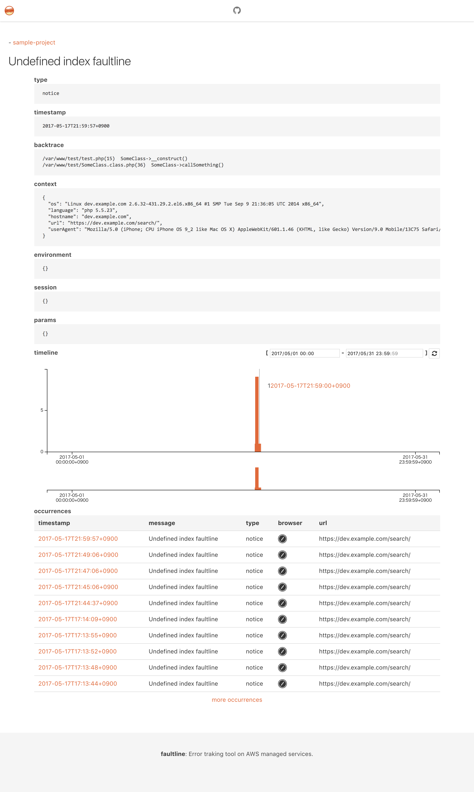

# faultline-webui []()

> Sample web UI for faultline



## Setup

Copy [`config.example.js`](config.example.js) to `config.js`. And edit.

```sh
$ open index.html
```

### use Docker

```sh
$ docker build -t faultline-webui:latest .
$ docker run --rm --name faultline-webui -p 80:80 -v $(pwd)/config.js:/usr/share/nginx/html/config.js faultline-webui:latest
$ open http://localhost/
```

## Contribute

PRs accepted.

## License

MIT © Ken&#39;ichiro Oyama
